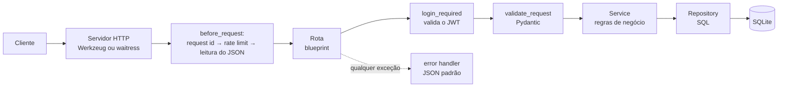

# Task API (Flask) — Anotações de estudo

> **Data:** 2026-10-06 · **Stack:** Python 3.12+ · Flask 3 · Pydantic 2 · PyJWT + bcrypt · SQLite · pytest · Docker

> **Como este arquivo foi feito:** a partir do código, do README e do histórico do Git. A ordem das fases segue a
> dependência entre as partes do código; o histórico do Git só registra o resultado final, não a ordem exata em que
> cada parte foi escrita. Pontos em que o motivo de uma decisão não está registrado estão marcados com **A confirmar**.

---

## 1. Visão geral

API REST de **gerenciamento de tarefas** (to-do list): cada usuário cria uma conta, faz login, recebe um token JWT e
gerencia só as próprias tarefas, com filtros, busca, ordenação e paginação.

O foco principal do projeto é o **tratamento de erros completo**: qualquer falha, seja um campo inválido, um token
vencido, um JSON quebrado ou um erro inesperado no servidor, devolve uma resposta JSON **sempre no mesmo formato**.

Tem um projeto irmão, o `task-api-express`, com os mesmos endpoints, códigos de erro e mensagens em Node.js +
Express. Os dois são compatíveis: um token gerado em um funciona no outro, desde que usem o mesmo `JWT_SECRET`.

> **A confirmar:** o objetivo era comparar Flask com Express (estudo), ou ter duas implementações por outro motivo?

---

## 2. Arquitetura

Não tem frontend: é só o backend (API), consumido por qualquer cliente HTTP (Swagger UI, Postman, um app web...).

### Caminho de uma requisição



### Camadas de cada módulo

| Camada | Responsabilidade | Exemplo |
|---|---|---|
| **routes** | Recebe a requisição HTTP, chama a validação e devolve a resposta | `tasks/routes.py` |
| **schemas** | Define o formato esperado dos dados (Pydantic) | `CreateTaskBody` |
| **service** | Regras de negócio (ex.: a tarefa é desse usuário?) | `TaskService._get_owned_task` |
| **repository** | Só acesso ao banco (SQL) | `TaskRepository.list` |

Separar assim deixa cada parte fácil de entender e testar. O service não sabe nada de HTTP, e o repository não sabe
nada de regras de negócio.

### Estrutura de pastas

```
main.py                 # ponto de entrada: sobe o servidor, trata sinais e erros de processo
app/
├── __init__.py         # create_app(): monta a aplicação (application factory)
├── config.py           # lê e valida as variáveis de ambiente
├── db.py               # conexões SQLite e criação das tabelas
├── errors.py           # AppError e atalhos (bad_request, not_found...)
├── error_handlers.py   # transforma QUALQUER exceção no JSON padrão
├── http_hooks.py       # request id, leitura do corpo, cabeçalhos de segurança
├── protocol_errors.py  # JSON também para erros que o servidor HTTP detecta antes do Flask
├── rate_limit.py       # limite de requisições por IP
├── validation.py       # integra o Pydantic e traduz as mensagens para português
├── logger.py           # log em JSON, uma linha por evento
├── clock.py            # data/hora no mesmo formato do JavaScript
├── docs/               # especificação OpenAPI + arquivos do Swagger UI
└── modules/
    ├── auth/           # cadastro, login, /me e o decorator login_required
    ├── tasks/          # CRUD de tarefas
    ├── users/          # acesso à tabela de usuários
    └── health/         # /health (a API e o banco estão de pé?)
tests/                  # 90 testes com pytest
Dockerfile, docker-compose.yml, .dockerignore   # empacotamento em container
```

---

## 3. Fases e etapas

### Fase 1 — Base do projeto e configuração
- **Objetivo:** ter um projeto Python organizado que só sobe se estiver bem configurado.
- **O que foi feito:**
  1. Projeto criado com **uv** (`pyproject.toml` + `uv.lock`).
  2. `config.py` lê as variáveis de ambiente (`.env`) e valida cada uma: tipo, mínimo, máximo e formato (`1h`, `100kb`).
  3. Os problemas são **acumulados** e mostrados todos de uma vez (classe `_Reader`), em vez de parar no primeiro.
  4. `create_app(config, db)` monta a aplicação recebendo a configuração e o banco por parâmetro.
- **Por quê:**
  - Validar a configuração na subida evita descobrir só em produção que o `JWT_SECRET` estava vazio.
  - Receber `config` e `db` por parâmetro (injeção de dependência) permite que os testes criem apps isolados com
    banco em memória.

### Fase 2 — Banco de dados
- **Objetivo:** guardar usuários e tarefas.
- **O que foi feito:**
  - Duas tabelas, `users` e `tasks`, com `FOREIGN KEY ... ON DELETE CASCADE`, `CHECK` nos campos `status` e
    `priority` e um índice em `tasks.user_id`.
  - Uma conexão por requisição: aberta quando é necessária (`get_conn`) e fechada no fim (`teardown_appcontext`).
  - Modo **WAL** no SQLite e `PRAGMA foreign_keys = ON` em cada conexão.
  - Suporte a `:memory:` com cache compartilhado, para os testes.
- **Por quê:**
  - O SQLite já vem com o Python (`sqlite3`): nenhum servidor de banco para instalar.
  - O `sqlite3` não deve ser compartilhado entre threads, por isso cada requisição tem a sua conexão.
  - O SQLite vem com as chaves estrangeiras **desligadas** por padrão; sem o PRAGMA, o `CASCADE` não funcionaria.

### Fase 3 — Tratamento de erros padronizado (o coração do projeto)
- **Objetivo:** toda resposta de erro no formato `{ "error": { status, code, message, details, requestId } }`.
- **O que foi feito:**
  1. `AppError`: uma exceção com status, código, mensagem, detalhes e cabeçalhos. Atalhos como `not_found()` e
     `unauthorized()` deixam o código mais legível.
  2. Um único `@app.errorhandler(Exception)` que converte **tudo** (`AppError`, erros do Werkzeug como 404/405/413 e
     exceções inesperadas) com `normalize_error()`.
  3. Erros 500 vão para o log com o stack trace. O cliente recebe só "Erro interno do servidor" (em desenvolvimento
     aparece também um campo `debug`).
  4. `requestId` em toda resposta e no cabeçalho `X-Request-Id`, para achar a requisição no log.
  5. `protocol_errors.py`: erros que o **servidor HTTP** detecta antes do Flask (requisição malformada, cabeçalhos
     gigantes) também saem em JSON, no Werkzeug e no waitress.
  6. Erros fora das requisições: configuração inválida, porta ocupada, exceções em threads e Ctrl+C/SIGTERM.
- **Por quê:**
  - O `code` é estável (`TASK_NOT_FOUND`) e serve para o programa cliente decidir o que fazer. A `message` é para
    humanos e pode mudar.
  - Nunca expor detalhes internos em produção: o stack trace revela a estrutura do código para um atacante.

### Fase 4 — Leitura do corpo e validação
- **Objetivo:** só deixar chegar às regras de negócio dados corretos, e explicar exatamente o que está errado.
- **O que foi feito:**
  - `http_hooks.py` confere `Content-Type`, charset (só UTF-8), `Content-Encoding` (aceita gzip/deflate), tamanho
    máximo e se o JSON é válido. Também rejeita `NaN`/`Infinity` e aceita só objeto ou array no corpo.
  - Proteção contra *zip bomb*: descompacta no máximo `limite + 1` bytes.
  - `validation.py`: os schemas Pydantic recebem camelCase no JSON (`dueDate`) e usam snake_case no Python
    (`due_date`). Campos desconhecidos são rejeitados (`extra="forbid"`).
  - As mensagens do Pydantic são traduzidas para português, com mensagens específicas por campo (`MESSAGES`).
  - `validate_request()` valida params, query e body juntos e devolve **todos** os problemas de uma vez em `details`.
- **Por quê:**
  - Devolver todos os erros de uma vez evita o cliente corrigir um campo, reenviar e descobrir o próximo erro.
  - `MISSING` (um objeto sentinela) diferencia "não mandou corpo" de "mandou `null`".

### Fase 5 — Autenticação (JWT + bcrypt)
- **Objetivo:** cadastro, login e proteção das rotas.
- **O que foi feito:**
  - `POST /auth/register` e `POST /auth/login` devolvem `accessToken`. `GET /auth/me` devolve o usuário logado.
  - A senha é guardada como hash **bcrypt**, nunca em texto puro.
  - JWT HS256 com `sub` (id do usuário), `iat` e `exp`. Na validação, `exp` e `sub` são obrigatórios.
  - O decorator `login_required` lê `Authorization: Bearer <token>` e coloca o usuário em `g.user`.
  - E-mail normalizado (minúsculas, sem espaços) com a mesma regex do Zod usada na versão Express.
- **Decisões de segurança importantes:**
  - **Mesma resposta e mesmo tempo** para "e-mail não existe" e "senha errada". Quando o e-mail não existe, o código
    compara com um *hash fictício* (`_dummy_hash`), para que o tempo de resposta não revele quais e-mails têm conta.
  - **Limite de 72 bytes na senha**: o bcrypt ignora o que passa disso, e um acento ocupa 2 bytes em UTF-8.
  - O token de um usuário que foi apagado é rejeitado, porque o código busca o usuário no banco a cada requisição.
  - Rate limit mais restrito nas rotas de autenticação (10 tentativas por 15 minutos), contra força bruta.

### Fase 6 — CRUD de tarefas
- **Objetivo:** criar, listar, buscar, atualizar e remover tarefas.
- **O que foi feito:**
  - `GET /tasks` com filtros (`status`, `priority`), busca (`search` no título e na descrição), paginação (`page`,
    `limit`) e ordenação (`sortBy`, `order`). A resposta traz `data` e `meta`.
  - `POST /tasks` devolve **201** e o cabeçalho `Location` com o endereço da nova tarefa.
  - `PATCH /tasks/:id` atualiza só os campos enviados (`exclude_unset`) e exige pelo menos um campo.
  - `DELETE` devolve **204** (sem corpo).
  - **404** quando a tarefa não existe e **403** quando ela pertence a outro usuário.
- **Por quê / detalhes:**
  - Todos os valores vão para o SQL como parâmetros (`?`), o que impede SQL injection. O `ORDER BY` não aceita
    parâmetros, então ele é escolhido de uma lista fechada (`ORDER_BY`).
  - `%` e `_` na busca são escapados (`_escape_like`), porque no `LIKE` eles são curingas.
  - Ao ordenar por `dueDate`, tarefas sem prazo ficam sempre no final. A ordenação por `priority` usa um `CASE`
    (low < medium < high) em vez da ordem alfabética.
  - 404 e 405 são respondidos **antes** de exigir o token: por isso o `login_required` está em cada rota, e não no
    blueprint inteiro. Essa é a mesma ordem de prioridade da versão Express.

### Fase 7 — Segurança HTTP
- **O que foi feito:**
  - **CORS** com `flask-cors`, expondo os cabeçalhos `X-Request-Id` e `Location`.
  - **Cabeçalhos de segurança** equivalentes aos do `helmet` do Express (CSP, `X-Frame-Options`, HSTS, ...).
  - **Rate limit próprio** (`RateLimiter`): janela fixa por IP, guardada em memória, com cabeçalhos `RateLimit` e
    `Retry-After` no padrão do IETF. O preflight de CORS (`OPTIONS`) não conta.
- **Por quê:** o rate limit foi escrito à mão para reproduzir exatamente o `express-rate-limit` da versão Express.
  > **A confirmar:** foi considerado usar o `Flask-Limiter`?

### Fase 8 — Documentação (OpenAPI + Swagger UI)
- **O que foi feito:** especificação OpenAPI 3 escrita em Python (`docs/openapi.py`) e servida em `/openapi.json`.
  A documentação interativa fica em `/docs`.
- **Segundo commit:** o pacote `swagger-ui-bundle` foi trocado pelos arquivos do **Swagger UI 5.33.1** copiados
  para dentro do projeto, com `StandaloneLayout` e botão de tema claro/escuro.
  - **Motivo:** o pacote Python parou na versão 4.x, que não tem tema escuro, e assim as duas versões (Flask e
    Express) usam o mesmo Swagger UI.
  - Só uma lista fechada de arquivos é servida (`STATIC_FILES`). Isso impede ler outros arquivos da pasta ou usar
    `../` para sair dela.
  - O script de inicialização fica num arquivo separado (`/docs/init.js`) porque a Content-Security-Policy bloqueia
    scripts inline.

### Fase 9 — Servidor e processo (`main.py`)
- **O que foi feito:**
  - `APP_ENV=development` usa o servidor do Werkzeug, que reinicia ao salvar um arquivo.
  - `APP_ENV=production` usa o **waitress**.
  - Saída do console em UTF-8 (evita erro ao logar acentos no Windows).
  - Mensagem clara quando a porta está ocupada ou sem permissão.
  - SIGTERM tratado como Ctrl+C: o servidor espera as requisições em andamento e fecha o banco.
- **Por quê:**
  - O waitress funciona no Windows. O gunicorn, servidor de produção mais comum em Python, só roda em Linux/macOS.
  - **`SO_EXCLUSIVEADDRUSE` no Windows:** a opção padrão (`SO_REUSEADDR`) deixava **dois processos** ouvirem a mesma
    porta sem nenhum erro. Veja a seção 7.

### Fase 10 — Testes
- **O que foi feito:** 90 testes com pytest (27 de auth, 23 de tarefas e 40 de erros/infraestrutura), com relatório
  de cobertura pelo `pytest-cov`.
  - A fixture `make_app` cria um app novo com **banco em memória** para cada teste, então um teste não interfere no
    outro.
  - O helper `expect_error()` confere que cada erro segue exatamente o formato padrão.
  - `BCRYPT_ROUNDS=4` nos testes, para o hash não deixar a suíte lenta.

### Fase 11 — Docker (ainda não commitado)
- **O que foi feito:**
  - `Dockerfile` **multi-stage**: a primeira etapa instala as dependências com uv, e a imagem final não leva o uv nem
    ferramentas de build.
  - Dependências copiadas **antes** do código: o cache do Docker só refaz a instalação quando o `uv.lock` muda.
  - Roda com um usuário sem privilégios (`appuser`), tem `HEALTHCHECK` chamando `/health` e guarda o banco num
    volume (`flask-data`).
  - `docker-compose.yml` lê o `JWT_SECRET` do `.env` e falha com uma mensagem clara se ele não existir
    (`${JWT_SECRET:?...}`). Usa `init: true` e `stop_grace_period: 15s` para o encerramento controlado.

---

## 4. Ferramentas e tecnologias

| Ferramenta | Para que serve (em geral) | Como foi usada aqui | Por que foi escolhida |
|---|---|---|---|
| **Python 3.12+** | Linguagem | Toda a aplicação | Versão mínima por causa de recursos como `datetime.UTC` e `autocommit` no `sqlite3` |
| **uv** | Gerenciador de pacotes e de ambientes Python | Instalar dependências, criar o `.venv`, rodar comandos | Muito mais rápido que o pip e gera um lockfile (`uv.lock`) |
| **Flask 3** | Microframework web | Rotas, blueprints, hooks, error handlers | Simples e explícito: bom para entender cada peça. **A confirmar:** por que Flask e não FastAPI? |
| **Pydantic 2** | Validação de dados com tipos Python | Schemas de body, query e params | Validação declarativa; faz o papel do Zod da versão Express |
| **PyJWT** | Gerar e validar tokens JWT | Login e `login_required` | Biblioteca padrão de JWT em Python |
| **bcrypt** | Hash de senhas | Cadastro e login | Algoritmo lento de propósito, o que dificulta força bruta |
| **SQLite (`sqlite3`)** | Banco de dados em arquivo | Usuários e tarefas | Já vem com o Python, não precisa de servidor |
| **python-dotenv** | Ler o arquivo `.env` | `main.py` | Configuração fora do código |
| **flask-cors** | Liberar acesso de outros domínios | CORS da API | Evita escrever os cabeçalhos de CORS à mão |
| **Werkzeug** | Base do Flask e servidor de desenvolvimento | Servidor com reload em dev | Já vem com o Flask |
| **waitress** | Servidor WSGI de produção | `APP_ENV=production` | Funciona no Windows |
| **pytest + pytest-cov** | Testes e cobertura | 90 testes | Padrão de mercado em Python |
| **Swagger UI 5 / OpenAPI 3** | Documentação interativa de API | `/docs` e `/openapi.json` | Permite testar a API pelo navegador |
| **Docker / Compose** | Empacotar e rodar em containers | Imagem da API + volume do banco | Roda igual em qualquer máquina |

### Explicando as principais

- **Flask:** um *microframework* que entrega o básico (rotas, requisição e resposta) e deixa o resto com você. Os
  **blueprints** agrupam rotas por módulo (`/auth`, `/tasks`). Os **hooks** (`before_request`, `after_request`)
  rodam código antes ou depois de toda requisição. O `g` é um "bolso" que vive durante uma única requisição.
- **Pydantic:** você descreve o formato dos dados com tipos Python (`title: str`, `status: Literal[...]`) e ele
  valida, converte e aponta os erros. `Annotated[str, StringConstraints(...)]` adiciona regras ao tipo, e os
  validadores (`BeforeValidator`/`AfterValidator`) rodam funções próprias antes ou depois da validação padrão.
- **JWT:** um token assinado com três partes (cabeçalho, payload e assinatura). O servidor não guarda sessão: ele
  confere a assinatura com o `JWT_SECRET`. O conteúdo **não é criptografado**, só assinado, então não coloque
  dados sensíveis no payload.
- **bcrypt:** gera um hash com *salt* aleatório. O número de rounds (`BCRYPT_ROUNDS`) controla quão lento ele é:
  cada +1 dobra o tempo.
- **uv:** substitui pip + venv + pip-tools. `uv sync` cria o ambiente igual ao `uv.lock`, e `uv run` executa os
  comandos dentro dele sem precisar ativar o `.venv`.
- **waitress vs Werkzeug:** o servidor do Werkzeug é só para desenvolvimento (reload e simplicidade). O waitress
  aguenta várias requisições ao mesmo tempo com segurança.

---

## 5. Comandos usados

```bash
# Instala as dependências e cria o .venv exatamente como está no uv.lock
uv sync

# Cria o arquivo de configuração a partir do exemplo (depois edite o JWT_SECRET)
cp .env.example .env

# Gera um JWT_SECRET aleatório e seguro
uv run python -c "import secrets; print(secrets.token_hex(48))"

# Sobe a API (dev: reinicia ao salvar | APP_ENV=production: waitress)
uv run main.py

# Roda os testes
uv run pytest

# Roda os testes com relatório de cobertura
uv run pytest --cov

# Adiciona uma dependência (atualiza pyproject.toml e uv.lock)
uv add nome-do-pacote

# Adiciona uma dependência só de desenvolvimento
uv add --dev nome-do-pacote

# Sobe a API em container (lê o JWT_SECRET do .env)
docker compose up --build
```

Endereços com a API rodando:
- API: http://localhost:5000
- Documentação: http://localhost:5000/docs
- Especificação: http://localhost:5000/openapi.json

---

## 6. Conceitos-chave

- **API REST:** recursos acessados por URLs (`/tasks/1`) e verbos HTTP (`GET` lê, `POST` cria, `PATCH` altera parte,
  `DELETE` remove).
- **Status HTTP:** 2xx deu certo (200, 201 criado, 204 sem conteúdo), 4xx o cliente errou (400, 401 sem login,
  403 sem permissão, 404, 409 conflito, 429 limite), 5xx o servidor errou.
- **401 vs 403:** 401 é "não sei quem você é" (token ausente ou inválido). 403 é "sei quem você é, mas isso não é
  seu" (a tarefa de outro usuário).
- **Application factory:** em vez de uma variável global `app`, uma função `create_app()` monta a aplicação. Isso
  permite criar várias instâncias com configurações diferentes, como nos testes.
- **Injeção de dependência:** as peças recebem o que usam por parâmetro (`TaskService(task_repository)`) em vez de
  criar por conta própria, o que facilita trocar e testar.
- **Padrão Repository:** isola o SQL numa classe. Se um dia trocar o SQLite pelo PostgreSQL, só o repository muda.
- **Decorator:** uma função que "embrulha" outra. `@login_required` roda a checagem do token antes da rota.
- **Variáveis de ambiente / `.env`:** a configuração fica fora do código. O `.env` real **nunca** vai para o Git
  (está no `.gitignore`); o `.env.example` vai.
- **SQL injection:** quando um texto do usuário vira parte do comando SQL. A defesa é usar parâmetros (`?`).
- **Ataque de tempo (timing attack):** descobrir informação medindo quanto tempo o servidor leva para responder. É
  por isso que o login sempre roda o bcrypt, mesmo quando o e-mail não existe.
- **Rate limiting:** limitar quantas requisições cada IP faz numa janela de tempo. Protege contra abuso e força bruta.
- **CORS:** regra do navegador que bloqueia chamadas de um site para outro domínio, a menos que a API autorize.
- **Paginação:** devolver os resultados em páginas (`LIMIT`/`OFFSET`) com `meta.total` e `meta.totalPages`.
- **Health check:** uma rota simples que diz se a aplicação e o banco estão funcionando. O Docker usa para saber se
  o container está saudável.
- **Multi-stage build:** um Dockerfile com várias etapas. A imagem final leva só o necessário para rodar, então fica
  menor e mais segura.
- **Encerramento controlado (graceful shutdown):** ao receber Ctrl+C ou SIGTERM, terminar as requisições em
  andamento e fechar o banco antes de sair.

---

## 7. Problemas encontrados e soluções

| Problema | Causa | Solução |
|---|---|---|
| Dois servidores rodando na **mesma porta** sem erro no Windows | `SO_REUSEADDR`, padrão do Werkzeug e do waitress, tem outro significado no Windows e permite isso | Abrir o socket com `SO_EXCLUSIVEADDRUSE` (`_bind_socket` em `main.py`) |
| Erros de protocolo saindo em **HTML ou texto puro** | O servidor HTTP responde antes de a requisição chegar ao Flask | `JsonErrorRequestHandler` (Werkzeug) e `patch_waitress_errors()` (waitress) |
| Swagger UI **sem tema escuro** | O pacote `swagger-ui-bundle` parou no Swagger UI 4.x | Arquivos do Swagger UI 5.33.1 copiados para `app/docs/swagger_ui/` |
| Script do Swagger **bloqueado** | A CSP (`script-src 'self'`) bloqueia scripts inline | Script servido como arquivo separado em `/docs/init.js` |
| Senhas longas com acento **truncadas** ou com erro | O bcrypt só usa 72 **bytes**, e acentos ocupam 2 bytes | Validar o limite em bytes no cadastro e cortar com segurança no login |
| `UnicodeEncodeError` ao logar acentos | O console do Windows nem sempre usa UTF-8 | `sys.stdout.reconfigure(encoding="utf-8")` |
| `json.loads` aceitando `NaN` | O Python aceita essas constantes por padrão, mas elas não são JSON válido | `parse_constant=_reject_constant` |
| E-mail duplicado em cadastros **simultâneos** | Corrida entre o "já existe?" e o `INSERT` | `UNIQUE` no banco + capturar `IntegrityError` e devolver 409 |
| Respostas diferentes da versão Express | Flask e Express têm comportamentos padrão diferentes (barra no final da URL, ordem de 404/405, formato de data) | `strict_slashes = False`, `login_required` por rota e `now_iso()` no formato do JavaScript |

> **A confirmar:** houve outros problemas durante o desenvolvimento que valem registrar aqui?

---

## 8. O que aprendi

- Montar uma API Flask organizada em módulos e camadas (routes → service → repository).
- Validar entradas com Pydantic e devolver erros claros, em português e todos de uma vez.
- Centralizar o tratamento de erros num formato único, incluindo os casos fora do Flask.
- Autenticação com JWT e bcrypt, e cuidados reais de segurança (ataque de tempo, limite do bcrypt, rate limit).
- Escrever SQL seguro (parâmetros, lista fechada no `ORDER BY`, escape no `LIKE`).
- Diferenças práticas entre Windows e Linux (sockets, codificação do console, servidor de produção).
- Testar uma API com pytest usando fixtures e banco em memória.
- Empacotar uma aplicação Python com Docker multi-stage e um usuário sem privilégios.
- Comparar o mesmo projeto em duas stacks (Flask × Express) ajuda a ver o que é conceito e o que é detalhe do
  framework.

---

## 9. Próximos passos / para estudar mais

**Melhorias possíveis**
- Fazer o commit dos arquivos do Docker (`Dockerfile`, `docker-compose.yml` e `.dockerignore` ainda não estão no Git).
- Trocar o SQLite por **PostgreSQL** e usar migrations (ex.: Alembic), em vez de `CREATE TABLE IF NOT EXISTS`.
- Rate limit compartilhado entre processos (ex.: Redis), já que hoje ele fica na memória de cada processo.
- Refresh token e logout (hoje o token só expira).
- CI (GitHub Actions) rodando `uv run pytest` a cada push.
- Linter e formatador (ex.: **Ruff**).

**Documentação oficial**
- Flask: https://flask.palletsprojects.com/
- Pydantic: https://docs.pydantic.dev/
- uv: https://docs.astral.sh/uv/
- PyJWT: https://pyjwt.readthedocs.io/
- pytest: https://docs.pytest.org/
- OpenAPI: https://spec.openapis.org/oas/latest.html
- Docker (multi-stage builds): https://docs.docker.com/build/building/multi-stage/
- OWASP (segurança de APIs): https://owasp.org/API-Security/
